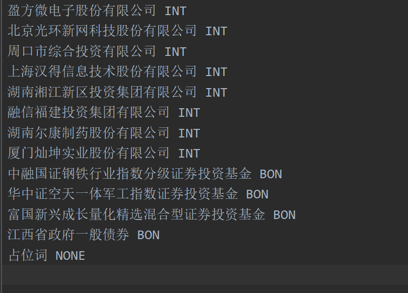

# BIO-sequence-label
BIO模式的-命名实体识别等任务的序列标注工具 
[对应的CSDN博客链接：](https://blog.csdn.net/broccoli2/article/details/103561708) 

笔者研究方向为NLP知识抽取，做实体识别实验过程中需要对训练数据进行标注。 
##处理流程如下：
（1）使用规则提取出要标注的实体，如“盈方微电子股份有限公司”，将提取出的实体保存至word_dict.txt文件中作为词典，并为每一类实体自行设计创建一类标签。 
（2）将待标注样本处理成一行，也就是一行是一个样本。
（3）根据自己需要选择标注好的文件的格式，可以是“taken空格labe”在一个文件中，也可以将token和label分开来。 

INT与BON为文本对应的标签。 
占位词 NONE，这一行必须要有，作为词典的停止关键词 

word_dict.txt文件如下图所示： 
 

标注好的数据如下图所示。 
启 B-INT 
迪 I-INT 
设 I-INT 
计 I-INT 
集 I-INT 
团 I-INT 
股 I-INT 
份 I-INT 
有 I-INT 
限 I-INT 
公 I-INT 
司 I-INT 
于 O  
今 O 
日 O 

有问题可提issues。觉得有用的话，欢迎star~

